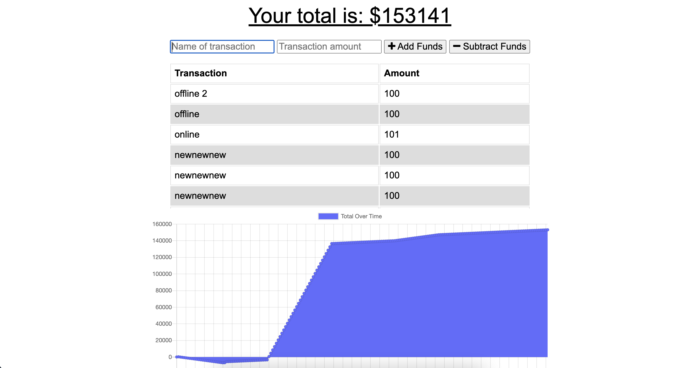
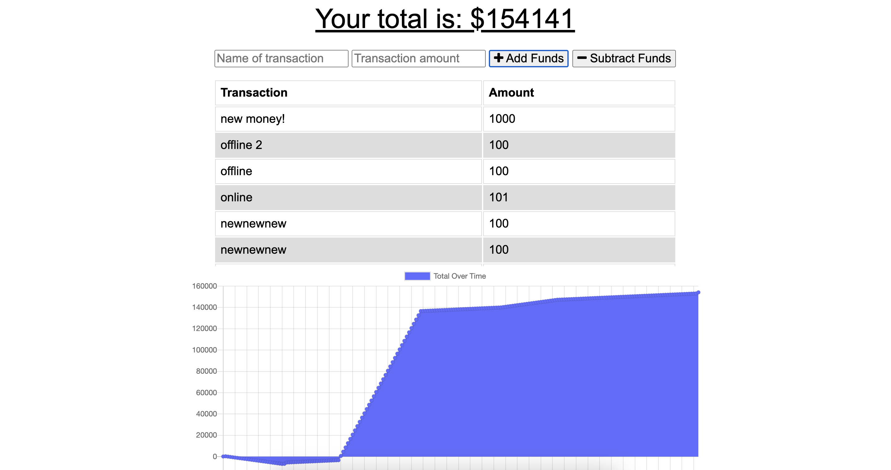

# budgetTracker

## Description
Simple budget tracker app.  Records amount deposited or withdrawn including short description of transaction.  Displays graph of users transaction history.  Also features offline transaction functionality.

## Installation
This app uses express, indexedDB and mongoDB.  Please install the proper npm packages shown in the package.json.
## Usage
When the app is loaded it displays the users previous transactions and the ability to add or subtract more money:

When a transaction is added your total and chart are updated:

    
